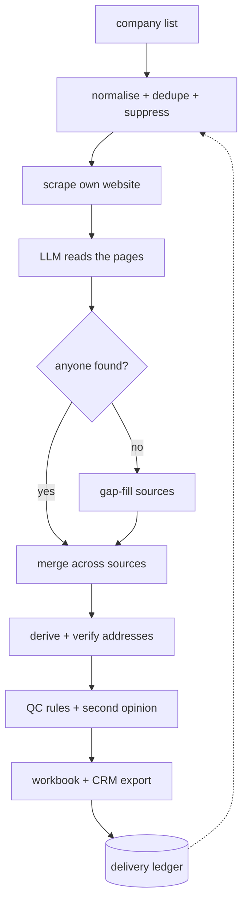

# Architecture

The design decisions behind a private production system, and what they cost. No source code, no
configuration, no schema.

Three ideas run through all of it:

1. **Cheap before expensive.** The free source runs first and carries most of the result. Paid
   sources only see companies the free ones failed on.
2. **Provenance is the product.** An address with no stated basis is worth less than no address,
   because someone will send to it.
3. **Degrade, never abort.** Any dependency can be missing or flaky. The result gets worse; the run
   does not stop.

## 1. Input and resolution

Client lists arrive as they are. Headers match case-insensitively and then normalised, and non-UTF-8
CSVs — the default when German Excel saves a file — decode through a fallback chain. Duplicate
companies collapse on domain, or on the name with its legal form stripped, before anything downstream
acts: every surviving duplicate gets scraped twice and paid for twice, which makes cleaning the list
the cheapest cost control here.

Scraping needs a domain. A usable website column in the list skips the external lookup entirely —
free, and more accurate than name matching. Otherwise the match confidence travels with every row
derived from it, so a weak match cannot present itself as a confident contact.

## 2. The free source carries the result

The workhorse is the company's own website. German companies must legally publish an imprint page
naming their managing directors, which makes it the highest-yield page on the internet for this
problem. Fetching is budgeted per site, because corporate sites are link-rich and without a cap one
site eats the run. robots.txt is respected; this runs against real companies, some of whom become
customers.

Sites that named nobody get one deeper pass, since large organisations bury leadership deep. **Those
results are union-merged over the first pass, never replaced.** Extraction is not deterministic, so a
re-scan can return a different set of people — a replace-merge silently dropped 51 already-found
people once.

Sites with almost no static HTML, or that refuse plain scrapers while opening normally in a real
browser, are re-fetched with headless Chromium — optional, so without it they stay empty rather than
breaking the run.

## 3. LLM extraction replaced regex

The first version extracted people with title regexes. The current one sends page text to a cheap
high-capability model: one call per site, strict JSON out, regex still there as an automatic
fallback.

**Measured effect: roughly 3× more contacts**, plus coverage of sites the regex could not parse at all
and per-person addresses lifted off the page. About a euro per run.

The lesson worth keeping: **negative instructions do not work.** Telling a model not to return
non-leadership titles is unreliable, so exclusion is enforced in code after the call.

## 4. Paid sources are gap-fill only

Three further sources, all opt-in, all restricted to companies the free ones left empty:

- **The German commercial register** — official filings name the registered managing directors of
  every GmbH and AG, exactly the gap a silent website leaves. Small free quota, so lookups are
  sequential and cached.
- **A B2B contact database** — broad coverage, but needs a paid plan and contributes nothing on a
  free one, which is why it is not a default: a source that silently returns zero reads as your bug.
- **A managed scraping platform** — returns people with addresses attached, so those rows skip
  derivation.

The platform bills a minimum number of leads per run, so remaining domains are batched into as few
runs as possible. **Gap-filling plus batching is the difference between a €3 run and a €50 one.**
Cached paid answers then merge unconditionally, unlike new lookups: a website scan that suddenly
finds two people must not make officers you already paid for disappear.

People merge on a canonicalised person key. Two independent sources naming the same person is the
strongest confidence signal in the system.

## 5. Provenance is the product

Every address records its origin: published on the site, returned by a paid source, derived from a
scheme a colleague's published address proved, or a shared company inbox. Derived candidates go to a
real-time verification service.

- **Published addresses are verified too.** Counter-intuitive, since they are already facts — but the
  value is the demotion. Skipping them once shipped eight dead mailboxes to a client.
- **The per-domain stop-loss requires zero hits ever, not merely many misses**, because one domain
  burned 117 credits before its first success.
- **No SMTP probing.** Enumerating strangers' mailboxes reads as abuse and would risk the client's
  own domain reputation; paying a service that already holds that relationship is the correct trade.

One personal address appearing on several people is an extraction artefact, not a discovery. It stays
with the person whose name matches the scheme, because mailing someone twice is worse than not
finding them.

Quality control flags rather than drops. Flagged rows plus a random sample of the rest get a
**second-opinion model call against the original page text** — the sample exists because rules only
catch failure modes we already thought of. An unresolved flag caps confidence, so filtering to high
and medium yields the clean list.

## 6. Operations

**Caching.** Writes are atomic and merge on save, so an interrupt cannot truncate a cache and
concurrent sessions cannot overwrite each other's paid entries. Transient failures are never cached.
An unparseable cache aborts the run loudly, because starting empty would quietly re-pay for
everything.

**Per-client isolation is a boundary, not a folder convention.** The workspace selects the cache, the
delivery ledger *and* the deduplication keys, so two clients with overlapping lists cannot suppress
each other's contacts. GDPR deletion is one operation on one directory. The hosted path keeps the
property: per-user storage prefixes, row-level security by owner, short-lived signed links. Jobs run
strictly one at a time — a real limitation, and the accepted trade for cache correctness.

**Keys.** Clients bring their own credentials, sealed in the browser against the worker's public key,
so the database only ever holds ciphertext. Each job's environment is built by pattern-blanking every
operator credential rather than by listing known providers, so the next provider added is covered
automatically.

**Repeat deliveries.** Delivered contacts enter a ledger that every later run excludes before any paid
step. It is deliberately not a cache: clearing a cache should cost money at worst, never re-send a
batch of emails.

**Tests.** 307, no network and no API keys, so they run in CI on every push. Separately, a small live
evaluation measures real extraction recall against hand-verified companies. The split is deliberate:
the fast suite protects the machinery, the live one protects extraction quality — unit tests cannot
tell you that a model got worse.
