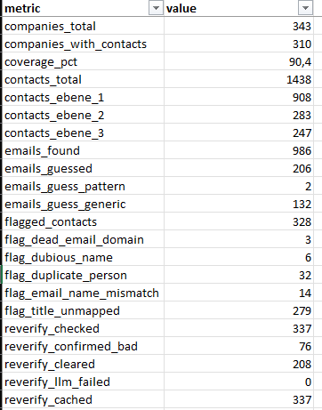

# leadenricher-pipeline

This repository documents a private production system. It contains no source code, no data, and no credentials.

## The problem

A sales team has a list of target companies and nobody to write to at any of them. Researching one decision-maker by hand — name, level, an address that actually accepts mail — takes five to ten minutes. Across a few hundred companies that is several person-weeks.

## What goes in

A list of company names, as a spreadsheet or a CSV, in whatever shape it arrived. Country and website columns are used when present and never required.

## What comes out

A workbook of decision-makers, C-level down to the third management level, one row per person: name, title, management level, company, the page they were found on, and an email address.

Every address states where it came from, because that changes how you use it:

- **confirmed** — a mail server accepted the mailbox
- **published** — printed on the company's own pages
- **pattern** — built from an address scheme that a colleague's published address proved
- **company inbox** — a real shared mailbox, not the person's own

Guesses never share a column with facts.

## The production run

One client list, delivered:

| | |
|---|---|
| Companies in | 343 |
| Companies with at least one contact | 310 (90%) |
| Executives found | 1,438 |
| Carrying an email address | 986 |
| Mailboxes machine-verified | 797 |
| Send-ready rows | 903 |
| API spend for the whole run | about €3 |

*From the QC sheet the pipeline wrote for that run.*

Every paid answer is cached, so re-running the list takes about twenty seconds and costs nothing.

## Stack

Python. Supabase for the job queue, authentication, and private file storage, row-level-security scoped per client. A serverless container worker on Modal, single-slot by design. Static frontend on Netlify. Playwright for sites that only exist after JavaScript runs. pandas and openpyxl for the workbook. 307 automated tests, no network and no API keys, run on every push.

[ARCHITECTURE.md](ARCHITECTURE.md) walks the pipeline stage by stage, describes the enrichment sources by category, and gives the reasoning behind each design decision.
